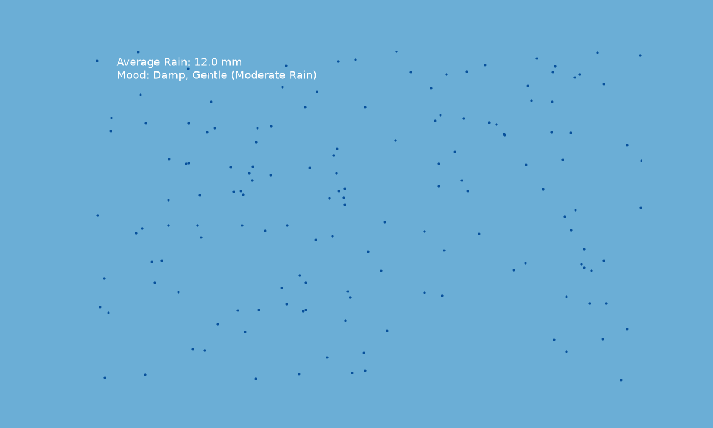
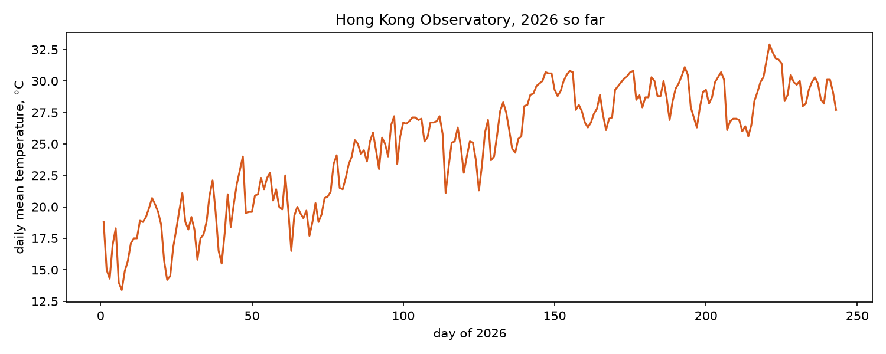

# The phenomenon


# The phenomenon

This project visualises rainfall across Hong Kong, a natural atmospheric phenomenon that fluctuates hour by hour with changing weather systems. Rainfall is chosen for this visualisation because it directly shapes the sensory mood of the environment; heavy downpours create a dense, immersive feeling while sunny periods bring calm and brightness. Instead of presenting rainfall as dry numerical statistics, this work translates the measured rainfall value into an atmospheric particle animation, exploring how abstract meteorological data can represent the emotional feeling of weather.


## The source

Data is retrieved from Hong Kong Observatory open API endpoint: https://data.weather.gov.hk/weatherAPI/opendata/weather.php?dataType=rhrread&lang=en. The JSON dataset contains rainfall readings from multiple automatic weather stations across Hong Kong. Each station entry holds a place name and the maximum one-hour accumulated rainfall in millimetres. It also includes relative humidity and a timestamp marking when the observations were recorded.

## What the picture shows

The animation shows falling raindrop particles, where rainfall magnitude controls background colour, particle count and falling speed. Denser, faster particles with a dark palette represent heavy rain, while sparse warm particles indicate dry sunny weather. This visualisation discards individual station-specific rainfall values; it uses only the average rainfall across all Hong Kong stations, losing regional spatial differences to focus purely on the overall atmospheric mood.

## Run it

```
uv run fetch.py
uv run plot.py
```
